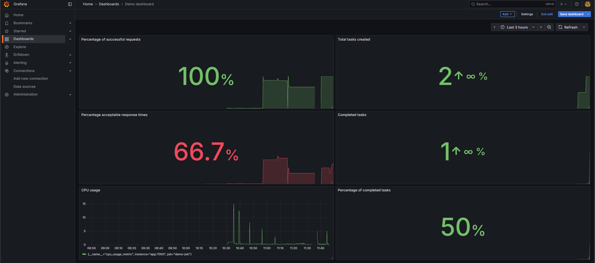

# OLA5 - Large systems


### Made by

- Lasse Hansen - cph-lh479@stud.ek.dk
- Pelle Hald Vedsmand - cph-pv73@stud.ek.dk
- Nicolai Rosendahl - cph-nr135@stud.ek.dk


## Objective of assignment: 
Students must deliver a monitoring plan, including non functional requirements table, KPI's, SLI's, SLO's and SLA. It must be defined what is monitored using RED and USE. We are to create a demo application being mapped with Prometheus and Grafana following the monotoring plan. 

## Deliverables: 

### A running application with Prometheus 

 - An app instrumented to expose Prometheus metrics.
 - A docker-compose file with Prometheus + Grafana + the application.
 - Prometheus scrape configurations.

### How to run:
    
To run the demo, use the following command: 

```
docker compose up --build -d
```

This will start the following 3 containers: 
- Task application, endpoints available on http://localhost:7000
- Prometheus, with dashboard availabe on http://localhost:9090
- Grafana, with dashboard available on http://localhost:3000 (username = admin, password = admin)

To tear the demo down use command:

```
docker compose down
```

### Result:

The application code is found within the GitHub repo, in the src folder.

The docker compose is found in the root of the repo, [docker-compose.yml](docker-compose.yml)

We are using a dockerfile to create the image used for the application and included in the compose file, it can be found in the root of the project. [Dockerfile](Dockerfile)

You can find the monitoring plan [here](documentation/ss-ola-5-sla.pdf).

#### Screen dumps of Grafana setup

The grafana dashboard includes the metrics from the SLA alongside the business KPI's with metrics on the left and KPI's on the right.

